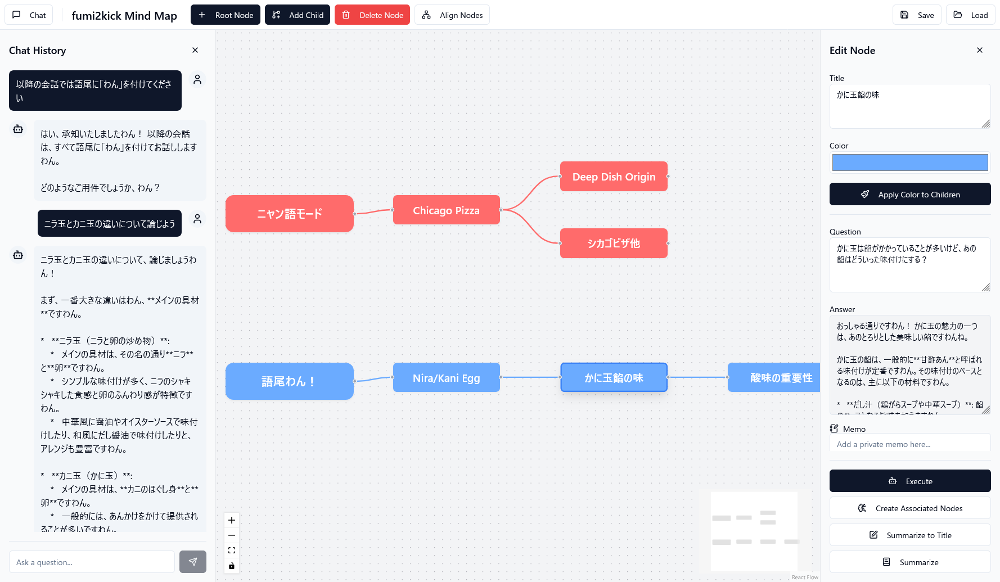

# AI Mind Map



AIとの対話を通じてアイデアを広げ、思考を整理するためのインテリジェント・マインドマッピングツールです。

Dyad + gemini 2.5 pro で作成しました。

AI機能の利用には OpenRouter API キーが必要です。

## ✨ 機能

### マインドマップ基本操作
- **ノードの追加**: ルートノードや子ノードを自由に追加できます。
- **ノードの削除**: 選択したノードとその配下の子ノードをまとめて削除できます。
- **ノードの編集**: 各ノードのタイトルや色を直感的に編集できます。
- **自動整列**: 複雑になったマップをワンクリックで綺麗に整列させます。

### AI連携機能
- **質問応答**: 各ノードに「問い」を設定し、AIからの「答え」を記録できます。過去の対話は文脈として引き継がれます。
- **タイトルの自動要約**: ノードの「問い」と「答え」の内容をAIが要約し、簡潔なタイトルを自動で設定します。
- **連想ワード展開**: 選択したノードのタイトルから、AIが関連性の高い単語を複数提案し、新しい子ノードとして一括で追加します。
- **チャットによるノード生成**: チャットウィンドウでAIと対話するだけで、その内容が新しい子ノードとして自動的にマインドマップに追加されます。

### 便利な機能
- **チャット履歴**: ノードを選択すると、そのノードに至るまでのAIとの対話履歴をチャット形式で確認できます。
- **プライベートメモ**: 各ノードに、AIとの対話とは別に個人的なメモを記録できます。
- **色の継承**: 親ノードの色を、その配下の子ノード全てに一括で適用できます。

### データの保存と読み込み
- **Markdown形式で保存**: 作成したマインドマップは、プレビュー可能なMermaid形式のグラフを含むMarkdownファイルとしてエクスポートできます。
- **ファイルの読み込み**: 保存したMarkdownファイルを読み込んで、いつでも作業を再開できます。

## 🛠️ 使用技術
- **フロントエンド**: React, TypeScript, Vite
- **スタイリング**: Tailwind CSS, shadcn/ui
- **状態管理**: Zustand
- **マインドマップ描画**: ReactFlow
- **AI連携**: OpenRouter API (または互換性のあるLLM API)

## ⚙️ 環境変数の設定

このアプリケーションを実行するには、プロジェクトのルートディレクトリに `.env` ファイルを作成し、以下の環境変数を設定する必要があります。

```.env
# OpenRouter APIキー
VITE_OPENROUTER_API_KEY="your_api_key_here"

# (任意) 使用するLLMモデル
VITE_OPENROUTER_MODEL="openai/gpt-3.5-turbo"

# (任意) 要約を依頼する際のプロンプト
VITE_SUMMARIZE_PROMPT="Please summarize this conversation concisely in Markdown format."
```

- `VITE_OPENROUTER_API_KEY`: AIとの通信に必須です。OpenRouterなどで取得したAPIキーを設定してください。
- `VITE_OPENROUTER_MODEL`: 使用する言語モデルを指定します。省略した場合は `openai/gpt-3.5-turbo` が使用されます。
- `VITE_SUMMARIZE_PROMPT`: ノードの会話内容を要約する際にAIに与える指示です。

## 🚀 起動方法

1.  **依存関係のインストール**:
    ターミナルで以下のコマンドを実行して、必要なパッケージをインストールします。
    ```bash
    npm install
    ```

2.  **環境変数の設定**:
    上記の「⚙️ 環境変数の設定」セクションを参考に、`.env` ファイルを作成・設定してください。

3.  **開発サーバーの起動**:
    以下のコマンドで開発サーバーを起動します。
    ```bash
    npm run dev
    ```
    サーバーが起動したら、ブラウザで `http://localhost:8080` にアクセスしてください。

## 使い方

### 基本的な使い方
- **ノードの追加**: ヘッダーの「Root Node」ボタンで最初のノードを作成します。ノードを選択した状態で「Add Child」ボタンを押すと、子ノードが追加されます。
- **編集**: ノードをクリックすると、右側に編集サイドバーが開きます。タイトル、色、メモなどを編集できます。
- **保存と読み込み**: ヘッダーの「Save」「Load」ボタンで、作業内容をMarkdownファイルとして保存・読み込みできます。

### AIとの対話
- **ノード編集サイドバーから**: 編集サイドバーの「Question」欄に質問を入力し、「Execute」ボタンを押すと、AIからの回答が「Answer」欄に表示されます。
- **チャットサイドバーから**: ヘッダーの「Chat」ボタンでチャットペインを開きます。ノードを選択した状態で質問を送信すると、AIとの対話が始まり、その結果が新しい子ノードとして自動で追加されます。
- **チャット履歴からの分岐**: 会話途中のノードで子ノードを作成すると、チャットコンテキストを分岐させることができます。会話の途中で話を脱線させて深掘りしたりして情報を広げることができます。


## 📄 ライセンス

このプロジェクトはMITライセンスの下で公開されています。詳細については[LICENSE](LICENSE)ファイルを参照してください。

## 👤 作者

- **rerofumi** - [GitHub](https://github.com/rerofumi) - rero2@yuumu.org

