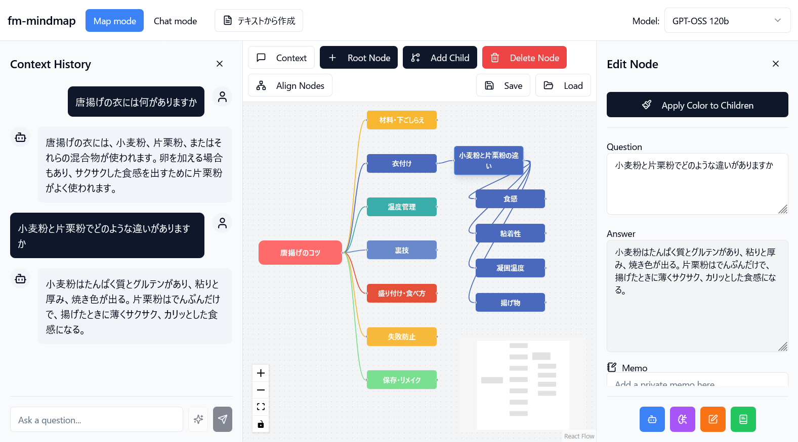
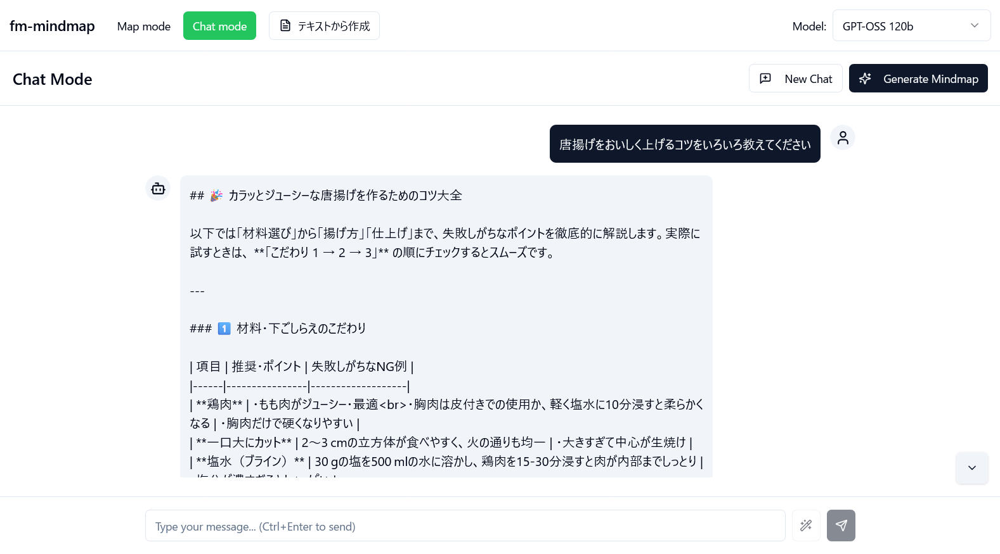

# AI Mind Map




AIとの対話を通じてアイデアを広げ、思考を整理するためのインテリジェント・マインドマッピングツールです。

AIコーディングサポートで作成しました。

AI機能の利用には OpenRouter API キーが必要です。

## ✨ 機能

### チャットモード
- 通常の AIチャットと同じです、会話の内容は保存されません
- チャットで相談しながら課題を抽出、整理してください
- チャットのログを分析してマインドマップのノードを生成することができます

### マップモード/マインドマップ基本操作
- **ノードの追加**: ルートノードや子ノードを自由に追加できます。
- **ノードの削除**: 選択したノードとその配下の子ノードをまとめて削除できます。
- **ノードの編集**: 各ノードのタイトルや色を直感的に編集できます。
- **自動整列**: 複雑になったマップをワンクリックで綺麗に整列させます。

### AI連携機能
- **質問応答**: 各ノードに「問い」を設定し、AIからの「答え」を記録できます。過去の対話は文脈として引き継がれます。
- **タイトルの自動要約**: ノードの「問い」と「答え」の内容をAIが要約し、簡潔なタイトルを自動で設定します。
- **コンテキスト対応の連想ワード展開**: 選択したノードのタイトルと**親ノードからの対話履歴全体**を考慮し、AIが文脈に即した示唆に富むキーワードを複数提案。新しい子ノードとして一括で追加します。
- **チャットによるノード生成**: チャットウィンドウでAIと対話するだけで、その内容が新しい子ノードとして自動的にマインドマップに追加されます。
- **LLMモデル選択**: ヘッダーのドロップダウンメニューから、タスクに応じて最適なLLMモデルをリアルタイムで切り替え可能（GPT-5, Qwen3, Claude, Gemini等、8種類のモデルに対応）。
- **テキストから自動生成**: 記事、レポート、議事録などの文章を入力すると、AIが内容を解析し、主要トピックと階層構造を持つマインドマップを自動生成します。

### 便利な機能
- **チャット履歴**: ノードを選択すると、そのノードに至るまでのAIとの対話履歴をチャット形式で確認できます。
- **プライベートメモ**: 各ノードに、AIとの対話とは別に個人的なメモを記録できます。
- **色の継承**: 親ノードの色を、その配下の子ノード全てに一括で適用できます。

### データの保存と読み込み
- **Markdown形式で保存**: 作成したマインドマップは、プレビュー可能なMermaid形式のグラフを含むMarkdownファイルとしてエクスポートできます。ファイル名は自動的にタイムスタンプ付きで生成されます（`mindmap_YYYYMMDD_HHMMSS.md`）。
- **ファイルの読み込み**: 保存したMarkdownファイルを読み込んで、いつでも作業を再開できます。既存データの上書き時には確認ダイアログが表示されます。

## 🛠️ 使用技術
- **フロントエンド**: React 18.3.1, TypeScript, Vite 6.3.4
- **スタイリング**: Tailwind CSS, shadcn/ui (Radix UI)
- **状態管理**: Zustand 5.0.6
- **マインドマップ描画**: React Flow 11.11.4
- **AI連携**: OpenRouter API
  - 対応モデル: GPT-5 Mini/Chat/OSS, Qwen3 Next, Claude Haiku/Sonnet 4.5, Gemini 2.5 Pro
- **Markdown表示**: React Markdown + remark-gfm
- **アイコン**: Lucide React
- **ID生成**: nanoid

## ⚙️ 環境変数の設定

このアプリケーションを実行するには、プロジェクトのルートディレクトリに `.env` ファイルを作成し、以下の環境変数を設定する必要があります。

```.env
# OpenRouter APIキー
VITE_OPENROUTER_API_KEY="your_api_key_here"

# (任意) 使用するLLMモデル
VITE_OPENROUTER_MODEL="openai/gpt-5-mini"
```

- `VITE_OPENROUTER_API_KEY`: AIとの通信に必須です。OpenRouterなどで取得したAPIキーを設定してください。
- `VITE_OPENROUTER_MODEL`: 使用する言語モデルを指定します。省略した場合は `openai/gpt-5-mini` が使用されます。アプリ起動後もヘッダーのドロップダウンメニューから動的に変更可能です。

## 🚀 起動方法

1.  **依存関係のインストール**:
    ターミナルで以下のコマンドを実行して、必要なパッケージをインストールします。
    ```bash
    npm install
    ```

2.  **環境変数の設定**:
    上記の「⚙️ 環境変数の設定」セクションを参考に、`.env` ファイルを作成・設定してください。

3.  **開発サーバーの起動**:
    以下のコマンドで開発サーバーを起動します。
    ```bash
    npm run dev
    ```
    サーバーが起動したら、ブラウザで `http://localhost:8080` にアクセスしてください。

## 使い方

### 基本的な使い方/チャットモード
- **モード切替**: ヘッダーの「Chat mode」タブをクリックしてチャットモードに切り替えます。
- **メッセージの送信**: 送信ボタン、もしくは Enter+Ctrl
- **メッセージ推敲**: 送信ボタンの左隣にあるリファインボタン（魔法の杖アイコン）で、入力中の文章をAIが自動校正・明確化します
- **メッセージクリア**: 「New Chat」ボタンで会話を消して新しいチャットを開始します
- **マインドマップ生成**: 「Generate Mindmap」ボタンでチャットの会話からマインドマップノードを作成します。マインドマップに既に書いてあったものは消えます（確認ダイアログなし）。生成後は自動的にマップモードに切り替わります。
- **テキストから生成**: ヘッダーの「テキストから作成」ボタンで、記事やレポートなどの文章からマインドマップを生成できます。

### 基本的な使い方/マップモード
- **モード切替**: ヘッダーの「Map mode」タブをクリックしてマップモードに切り替えます。
- **ノードの追加**: ツールバーの「Root Node」ボタンで最初のノードを作成します。ノードを選択した状態で「Add Child」ボタンを押すと、子ノードが追加されます。
- **ノードの直接編集**: ノードをダブルクリックすると、その場でタイトルを編集できます（Enterで確定、Escapeでキャンセル）。
- **編集サイドバー**: ノードをクリックすると、右側に編集サイドバーが開きます。タイトル、質問、回答、色、メモなどを編集できます。
- **自動整列**: ツールバーの「Align Nodes」ボタンで、木構造に基づいてノードを自動的に整列配置します。
- **色の一括適用**: サイドバーの「Apply Color to Children」ボタンで、選択ノードの色を全ての子孫ノードに適用できます。
- **保存と読み込み**: ツールバーの「Save」「Load」ボタンで、作業内容をMarkdownファイルとして保存・読み込みできます。

### マップモードでのAIとの対話
- **ノード編集サイドバーから**: 編集サイドバーの「Question」欄に質問を入力し、「Execute」ボタンを押すと、AIからの回答が「Answer」欄に表示されます。親ノードからの対話履歴が自動的にコンテキストとして使用されます。
- **チャットサイドバーから**: ツールバーの「Chat」ボタンでチャットペインを開きます。ノードを選択した状態で質問を送信すると、AIとの対話が始まり、その結果が新しい子ノードとして自動で追加されます（タイトルも自動生成されます）。
  - **メッセージの送信**: 送信ボタン、もしくは Enter+Ctrl
  - **メッセージ推敲**: 送信ボタンの左隣にあるリファインボタン（魔法の杖アイコン）で入力中の文章をAI整形します
- **連想ワード展開**: サイドバーの「Create Associated Nodes」ボタンで、選択ノードのタイトルと親ノードからの対話履歴を考慮した、文脈に即した4つのキーワードを自動生成します。
- **タイトル自動生成**: サイドバーの「Summarize to Title」ボタンで、質問と回答からAIが適切なタイトル（10-15文字程度）を自動生成します。
- **サマライズ**: サイドバーの「Summarize」ボタンで、現在のノードまでの対話履歴を要約し、Markdown形式でモーダルに表示します。
- **チャット履歴からの分岐**: 会話途中のノードで子ノードを作成すると、チャットコンテキストを分岐させることができます。会話の途中で話を脱線させて深掘りしたりして情報を広げることができます。


## 📄 ライセンス

このプロジェクトはMITライセンスの下で公開されています。詳細については[LICENSE](LICENSE)ファイルを参照してください。

## 更新内容

- Nov.16.2025 (v3)
  - **チャット中心UIモード追加**: マインドマップを介さず、直接AIとの対話を開始できるスタンドアローンチャットモードを実装。チャットからマインドマップを自動生成可能。
  - **LLMモデル選択機能**: ヘッダーのドロップダウンメニューから8種類のモデル（GPT-5, Qwen3, Claude, Gemini等）をリアルタイムで切り替え可能に。
  - **テキストから自動生成**: 記事、レポート、議事録などの文章を入力すると、AIが内容を解析し、階層構造を持つマインドマップを自動生成。
  - **コンテキスト対応の連想ワード生成**: 親ノードからの対話履歴全体を考慮し、より文脈に即した示唆に富むキーワードを提案。
  - **プロンプト管理の一元化**: `lib/prompts.ts` でアプリケーション全体のプロンプトを管理。
  - **UIの改善**: ビューモード切替タブ、メッセージ改良ボタン（魔法の杖アイコン）、Scroll to bottom ボタンなど。
- Jun.28.2025 (v1)
  - first release

## 👤 作者

- **rerofumi** - [GitHub](https://github.com/rerofumi) - rero2@yuumu.org

